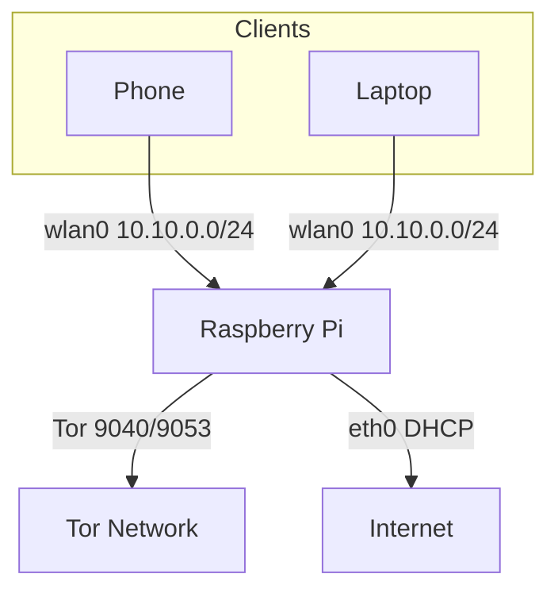

# ToraTora

ToraTora turns a Raspberry Pi into a Wi‑Fi access point whose traffic is transparently routed through the Tor network. Clients connecting to the Pi's WLAN are forced through Tor with no clearnet escape path.

## Overview
* **Torified AP** – Every TCP connection and DNS query from Wi‑Fi clients is redirected into Tor's `TransPort`/`DNSPort`.
* **Threat model** – Designed for users who trust the local network but wish to hide destination IP information from their ISP or local observers. It does **not** anonymize traffic leaving Tor nor protect against malicious Tor exit nodes.

## Architecture


## Prerequisites
* Raspberry Pi 4 (or compatible with onboard Wi‑Fi)
* Raspberry Pi OS Bullseye or Bookworm
* Internet connectivity on `eth0`
* Keyboard/console or SSH access with sudo privileges

## Prepare the SD card
1. Download and install the [Raspberry Pi Imager](https://www.raspberrypi.com/software/).
2. Insert your micro‑SD card and launch the Imager.
3. **Choose OS** ➝ *Raspberry Pi OS (other)* ➝ *Raspberry Pi OS Lite (64‑bit)* for a headless image.
4. Click the gear icon to pre‑configure:
   * Hostname, username, and password.
   * Enable SSH and (optionally) Wi‑Fi credentials for first boot.
5. Write the image to the card, insert it into the Pi, and power it on.

## Quick start
```bash
curl -L https://raw.githubusercontent.com/rub1n0/toratora/refs/heads/main/setup-tor-ap.sh -o setup-tor-ap.sh
sudo bash setup-tor-ap.sh --ssid toratora --psk "YourStrongPass" --country US --subnet 10.10.0.0/24 --channel 6
```
Expected banner:
```
 _____              _____
|_   _|__  _ __ __ |_   _|__  _ __ __ _
  | |/ _ \| '__/ _` || |/ _ \| '__/ _` |
  | | (_) | | | (_| || | (_) | | | (_| |
  |_|\___/|_|  \__,_||_|\___/|_|  \__,_|
ToraTora - Tor Wi-Fi Access Point installer
```

## Inputs & defaults
| Flag | Default | Description |
|------|---------|-------------|
| `--ssid` | `toratora` | SSID broadcast by hostapd |
| `--psk` | _prompted_ | WPA2 passphrase (min 12 chars) |
| `--country` | `US` | Wi‑Fi regulatory domain |
| `--subnet` | `10.10.0.0/24` | LAN subnet, gateway `.1` |
| `--channel` | `6` | 2.4 GHz channel |
| `--dry-run` | n/a | Show actions without applying |
| `--revert` | n/a | Restore backups and disable services |
| `--quiet` | n/a | Suppress non‑essential logs |
| `--no-color` | n/a | Disable ANSI colours |

## What the script changes
* Installs packages: `tor`, `hostapd`, `dnsmasq`, `jq`, and firewall tooling (`nftables` on Bookworm, `iptables-nft` on Bullseye).
* Configures static IP for `wlan0` and enables IPv4 forwarding, disables IPv6.
* Writes configs:
  * `/etc/hostapd/hostapd.conf`
  * `/etc/dnsmasq.d/tor-ap.conf`
  * `/etc/tor/torrc`
  * `/etc/nftables.conf` or `/etc/iptables/rules.v4`
* Enables services: `nftables`/`netfilter-persistent`, `dnsmasq`, `tor`, `hostapd`.
* All modified files are backed up to `/var/backups/toratora` with a `.toratora.<timestamp>.bak` suffix.

## Validation
1. Ensure the AP is up:
   ```bash
   ip addr show wlan0
   ```
2. Verify Tor ports:
   ```bash
   sudo ss -lnptu | grep -E '9053|9040'
   torsocks curl https://check.torproject.org/api/ip
   ```
3. Connect a Wi‑Fi client and browse [check.torproject.org](https://check.torproject.org) to confirm `IsTor: true`.

## Troubleshooting
* **Installer log** – review `/var/log/toratora.log` for full command output, especially if the "Configure network" step fails.
* **Wi‑Fi blocked** – run `rfkill list` and `rfkill unblock wifi`.
* **hostapd fails** – check `journalctl -u hostapd` for channel/country errors.
* **NetworkManager vs dhcpcd** – ensure only one manages `wlan0`.
* **Tor not listening** – check `/var/log/syslog` and `journalctl -u tor`.
* **DNS leaks** – verify firewall rules, ensure IPv6 disabled.
* **IPv6** – disabled by default; re‑enable by editing `/etc/sysctl.d/99-tor-ap.conf`.

## Security considerations
* Use only on networks you control.
* WPA2 passphrase should be strong; change defaults.
* Tor exit nodes can observe unencrypted traffic – use HTTPS.
* No clearnet NAT path is provided; all traffic goes through Tor.
* Logs remain on the Pi; inspect `/var/log` and consider log rotation.

## Customization
* Change `--subnet`, `--channel`, or `--country` to suit your environment.
* 5 GHz requires compatible hardware and adjusted `hw_mode`/channel.
* Alternate interface names (e.g., USB Wi‑Fi) can be set by editing the script variables.
* To enable IPv6 for clients, remove the disable lines from `99-tor-ap.conf` and extend firewall rules.

## Support matrix
| OS | Firewall |
|----|----------|
| Bookworm | `nftables` |
| Bullseye | `iptables-nft` + `netfilter-persistent` |

## Uninstall / Revert
Run the script with `--revert` to restore backed up configurations and disable services.
Manual cleanup: remove `/etc/hostapd/hostapd.conf`, `/etc/dnsmasq.d/tor-ap.conf`, `/etc/tor/torrc`, and firewall rules; uninstall packages if desired.

## License
MIT. Inspired by the guide at [pimylifeup.com](https://pimylifeup.com/raspberry-pi-tor-access-point/).
