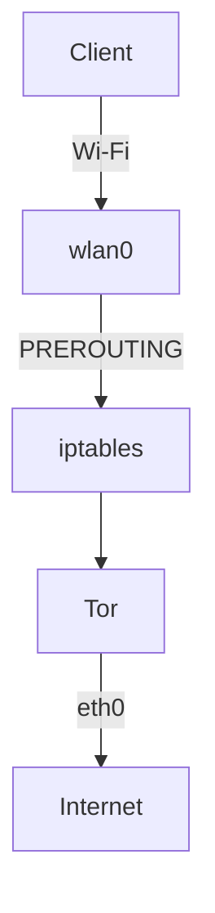
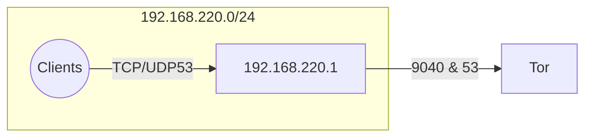

# Raspberry Pi Tor Wi-Fi Access Point

Turn a Raspberry Pi running Raspberry Pi OS Bookworm into a Wi-Fi hotspot
whose clients are transparently routed through the Tor network. The setup
is idempotent, reversible, and uses NetworkManager for Wi-Fi configuration.

## At a Glance
- One-command setup script
- Wi-Fi access point via NetworkManager
- Transparent Tor routing (TransPort/DNSPort)
- Idempotent & reversible configuration
- Works on Raspberry Pi OS Bookworm
- Optional Unicorn HAT status display

## Architecture





## How It Works
NetworkManager creates a hotspot on `wlan0` with gateway `192.168.220.1`.
`iptables` PREROUTING rules redirect all TCP SYN packets and DNS queries
from clients to Tor's `TransPort` and `DNSPort`. Tor then routes outbound
traffic through `eth0`. No masquerading is needed because Tor manages the
egress path. Non-TCP protocols (other than UDP/53) are not proxied and will
fail.

## Security Considerations
- Use a strong pre-shared key; the SSID is fixed to `toratora`.
- Keep the system updated.
- Misconfiguration may expose traffic; Tor exit policies do not guarantee safety.
- Logging in to personal accounts still reveals identity; do not route illegal traffic.
- Optional hardening: disable password SSH, use key authentication, rotate the PSK, and restrict management to Ethernet.

## Prerequisites
- Raspberry Pi with Wi-Fi, SD card, power, and wired internet on `eth0`.
- Raspberry Pi OS **Bookworm** (32- or 64-bit).

## Dependencies
The setup script installs the following packages if they are not present:

- `tor`
- `iptables`
- `iptables-persistent`
- `qrencode`
- `network-manager`

## Raspberry Pi Setup (from blank SD to first boot)
1. Flash Raspberry Pi OS with Raspberry Pi Imager.
2. (Optional) enable SSH and set Wi-Fi country in the Imager.
3. Boot the Pi, change the default password.
4. Update the system:
   ```bash
   sudo apt update && sudo apt -y upgrade
   ```
5. Verify NetworkManager:
   ```bash
   nmcli --version
   ```
6. Confirm interface names:
   ```bash
   ip link
   ```
7. Set timezone/locale/keyboard as needed.

## Script Installation & Usage
Download or clone this repository, then run the script with root privileges, providing the desired Wi-Fi password as `<PSK>`:
```bash
chmod +x setup-tor-ap.sh
sudo bash ./setup-tor-ap.sh <PSK>
```
Environment variables (override defaults):
- `AP_IFACE` (default `wlan0`)
- `WAN_IFACE` (default `eth0`)
- `AP_SUBNET` (default `192.168.220.0/24`)
- `AP_GATEWAY` (default `192.168.220.1`)
- `TOR_TRANS_PORT` (default `9040`)
- `TOR_DNS_PORT` (default `53`)

Flags:
- `--dry-run` – show actions without making changes
- `--uninstall` – revert all changes

Backups: `/etc/tor/torrc.bak` is created once. Sysctl and iptables files are modified idempotently.

## What the Script Changes
- `/etc/tor/torrc` – adds TransPort/DNSPort, Automap, logging
- `/var/log/tor/notices.log`
- `/etc/sysctl.d/99-tor-ap.conf` – enables IPv4 forwarding
- `/etc/iptables/rules.v4` (and `/etc/iptables.ipv4.nat` if present) – persists NAT redirects
- NetworkManager connection `tor-ap`

Services: enables `tor` and saves iptables rules for automatic restore at boot.

## Verification Checklist
After setup completes, the script automatically checks that the hotspot, Tor service, iptables rules, and IP forwarding are working. You can also manually confirm:
- `nmcli dev` shows hotspot active on `wlan0` with IP `192.168.220.1`.
- `sudo systemctl status tor` is “active (running)”.
- `sudo iptables -t nat -L -n -v` lists the three redirect rules.
- On a client connected to the AP:
  - DNS queries resolve.
  - `curl https://check.torproject.org/` shows Tor usage.

## Optional Status Matrix
If a Pimoroni Unicorn HAT or Unicorn HAT HD is attached you can run
`status_matrix_service.py` to display Pi health, Tor status, access point
status, and traffic levels. The service reads settings from
`status_matrix.yaml`. Set `use_unicorn_hat: false` in that file if the
hardware is not present. Install the Python dependencies with:

```bash
sudo apt install python3-yaml python3-unicornhat python3-unicornhathd
# or use: pip install -r requirements.txt
```

The setup script will automatically launch the status matrix service
when a Unicorn HAT is detected.

## Troubleshooting
- **Tor bind errors**: ensure the hotspot is up before Tor starts; the script retries for 30s.
- **No internet**: confirm `eth0` has DHCP connectivity (`ping -c1 1.1.1.1`).
- **DNS fails**: verify the UDP/53 PREROUTING rule and the `DNSPort` line in `torrc`.
- **Wrong interface names**: override with environment variables.
- **iptables not persisting**: reinstall `iptables`/`iptables-persistent`.
- **Wi-Fi country issues**: set the regulatory domain with `raspi-config`.

## Uninstall / Revert
```bash
sudo bash ./setup-tor-ap.sh --uninstall
```
Removes the NetworkManager hotspot, Tor configuration, NAT rules, and sysctl settings, restoring backups where possible.

## FAQ
- **Why not nftables?** Bookworm's `iptables-nft` provides compatibility; the script uses classic `iptables` for parity with common guides.
- **Can I change the subnet?** Yes, set `AP_SUBNET`/`AP_GATEWAY` environment variables.
- **Does it route UDP?** Only DNS (UDP/53). Other UDP protocols are unsupported through Tor TransPort.
- **How do I customize SSID/PSK?** The SSID is always `toratora`; provide the desired PSK as an argument when running the script.

## Ethics & Legal
Use Tor responsibly. Ensure that all traffic routed through this access point complies with local laws. The authors assume no liability for misuse.

## Maintenance
- Keep packages updated: `sudo apt update && sudo apt -y upgrade`.
- Rotate the Wi-Fi password and re-run the script to apply changes.
- Re-running the script is safe; it is idempotent.

## Changelog & License
- v1.0.0 – Initial release

Released under the MIT License.

## Credits
Inspired by PiMyLifeUp’s “Tor Access Point” and “Raspberry Pi Access Point” guides.

